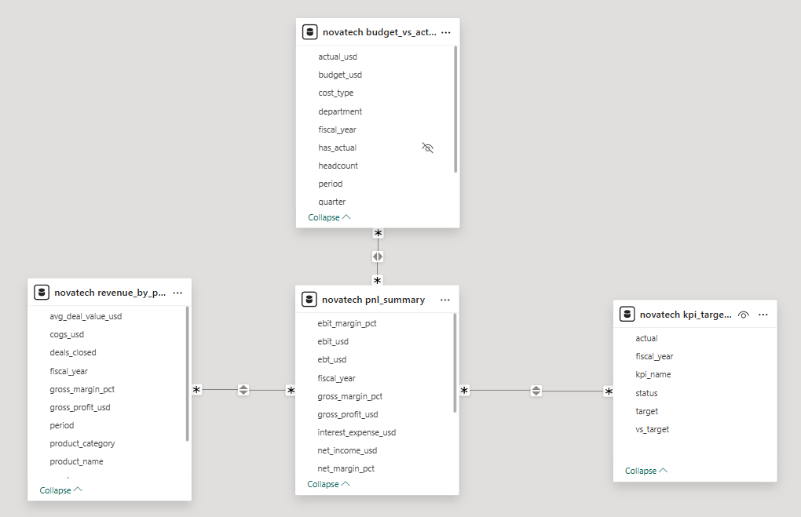
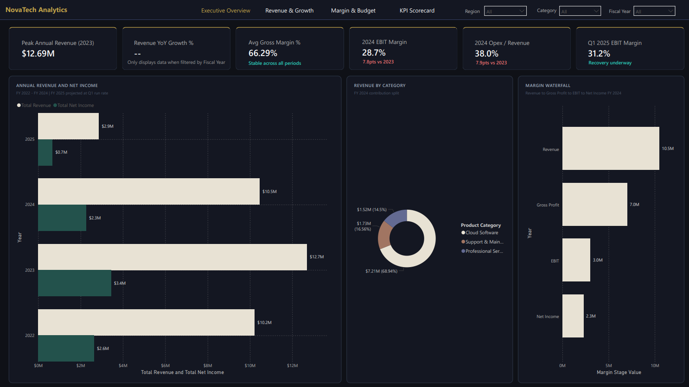
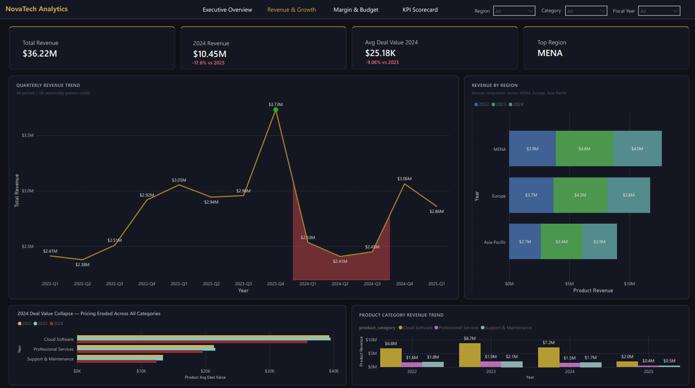
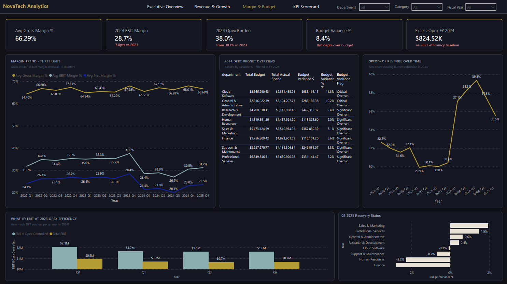

# NovaTech Solutions — Financial Performance Analytics

**End-to-end financial analytics project** covering data modeling, SQL business analysis, Power BI executive dashboard, and DAX measures across 13 quarters of synthetic B2B software company data.

---

## Project Summary

NovaTech Solutions is a synthetic B2B software company operating across MENA, Europe, and Asia-Pacific with three product lines: Cloud Software, Professional Services, and Support & Maintenance.

This project analyzes 13 quarters of financial performance (FY 2022 – Q1 2025) to answer one central business question: **what caused NovaTech's financial performance to collapse in 2024, and is the recovery in Q1 2025 genuine?**

The answer: a double crisis — revenue contracted 17.6% due to systematic deal discounting (−9.2% avg deal value), while operating expenses simultaneously ballooned from 30.1% to 38.0% of revenue, with 32 of 32 departments exceeding budget. EBIT margin dropped 7.8 percentage points. Q1 2025 shows the first signs of genuine recovery with cost controls working across multiple departments.

---

## Tech Stack

| Layer | Tool | Purpose |
|---|---|---|
| Database | PostgreSQL | Schema design, data import, business analysis |
| Query Language | PostgreSQL (CTEs, window functions, CASE, CROSS JOIN) | 35 business questions across 7 analytical sections |
| Visualization | Power BI Desktop | 4-page executive dashboard |
| Data Modeling | DAX | 38 measures across 5 folders |
| Architecture | Staging → Analytics | Finance data arrives pre-aggregated — no medallion needed |

---

## Dataset

Four synthetic CSV tables generated to reflect realistic B2B software financials. All figures are fictional but modeled on realistic industry benchmarks.

| Table | Rows | Description |
|---|---|---|
| `pnl_summary.csv` | 13 | Quarterly P&L from revenue to net income |
| `budget_vs_actuals.csv` | 128 | Department-level budget vs actual spend with variance flags |
| `revenue_by_product_region.csv` | 351 | Revenue, COGS, and gross margins by product × region × quarter |
| `kpi_targets_actuals.csv` | 28 | 7 KPIs tracked against targets across 4 fiscal years |

---

## SQL Analysis Structure

```
sql/
├── 01_CREATE_IMPORT_VALIDATE.sql
│   ├── Section 1: Schema & Staging Tables
│   ├── Section 2: Data Import (COPY from CSV)
│   └── Section 3: Data Validation & Sanity Checks
│
└── 02_FINANCIAL_BUSINESS_ANALYSIS.sql
    ├── Section 4: Revenue & Growth Analysis
    ├── Section 5: Margin & Profitability Analysis
    ├── Section 6: Budget Variance Analysis
    └── Section 7: KPI Scorecard & Forward Look
```

### Key SQL Techniques

- `LAG()` window function for YoY growth calculations across fiscal years
- `CROSS JOIN` with CTE baseline for what-if opex efficiency analysis
- `AVG() OVER()` seasonal index modeling for 2025 revenue projections
- Conditional aggregation (`CASE WHEN`) for KPI hit rate scoring
- Pivot-style quarterly trend queries using `MAX(CASE WHEN quarter = ...)`
- `NULLIF()` to guard against division by zero in per-head cost calculations

---

## Data Model



**Three Many-to-Many relationships, Both directions:**

- `pnl_summary[period]` ↔ `budget_vs_actuals[period]`
- `pnl_summary[period]` ↔ `revenue_by_product_region[period]`
- `pnl_summary[fiscal_year]` ↔ `kpi_targets_actuals[fiscal_year]`

Supporting calculated tables: `_Measures` (38 DAX measures), `Margin Stages` (waterfall visual)

**Architectural decision:** No medallion architecture. Finance data arrives pre-aggregated from source systems — a Bronze→Silver→Gold pipeline adds complexity with no analytical benefit for quarterly P&L data. Four staging tables connect directly to Power BI via Import mode.

---

## Power BI Dashboard — 4 Pages

### Page 1 — Executive Overview



High-level KPI cards with the full revenue-to-net-income story. Annual revenue bar chart showing the 2023 peak and 2024 contraction, revenue by category donut, and margin waterfall. Cards are pinned to specific years via visual-level filters so the crisis narrative holds regardless of slicer selection.

**Key visuals:** 6 KPI cards · Clustered bar chart · Donut chart · Margin waterfall

---

### Page 2 — Revenue & Growth



Answers the core question: was 2024's revenue decline a volume problem or a pricing problem? The quarterly trend line makes the 2023 peak and 2024 collapse visually immediate. The deal value collapse chart shows avg deal value fell ~9% across all three product categories simultaneously — confirming systematic discounting, not volume loss.

**Key visuals:** Quarterly revenue trend line · Revenue by region bar · Deal value collapse horizontal bar · Product category revenue trend

---

### Page 3 — Margin & Budget



The analytical heart of the project. Three margin lines (gross, EBIT, net) show gross margin held stable at ~66% while EBIT collapsed — isolating opex as the root cause, not COGS. The department budget overrun table ranks all 8 departments. The what-if EBIT chart quantifies how much profit was lost per quarter by spending above 2023 efficiency levels.

**Key visuals:** Three-line margin trend · Budget overrun table · Opex % area chart · What-if EBIT clustered column · Q1 2025 recovery horizontal bar

---

### Page 4 — KPI Scorecard


Full KPI execution tracking across all 7 metrics for 4 fiscal years. Hit rate dropped from 85.7% in 2023 to 42.9% in 2024. Gross margin has missed target 4 consecutive years — the only chronic miss. Three trajectory cards show where 2025 stands against full-year targets.

**Key visuals:** Full KPI scorecard table · KPI miss magnitude bar chart · Three 2025 trajectory cards

---

## DAX Measures — 36 Total

| Folder | Count | Key Measures |
|---|---|---|
| 00 - Revenue | 8 | Total Revenue, YoY Growth %, Product Revenue, Avg Deal Value, Deal Value Change YoY % |
| 01 - Margin | 9 | Avg Gross/EBIT/Net Margin %, Opex % of Revenue, Excess Opex vs 2023, EBIT If Opex Controlled |
| 02 - Budget | 8 | Total Budget, Actual Spend, Variance $/%, Depts Over Budget, Budget Variance Flag |
| 03 - KPI | 6 | KPI Hit Rate %, Miss Count, Hit Count, Avg vs Target, 2025 EBIT Gap, Trajectory Label |
| 04 - Labels | 5 | Formatted text measures for card subtitles |

---

## Key Business Findings

| # | Finding | Evidence |
|---|---|---|
| 1 | 2024 revenue contracted 17.6% | $12.7M (2023) → $10.5M (2024) |
| 2 | Pricing not volume drove the decline | Avg deal value fell −9.2% across all 3 categories |
| 3 | Opex expanded 800bps in 2024 | From 30.1% to 38.0% of revenue |
| 4 | Every department overspent in 2024 | 32 of 32 budget rows show positive variance |
| 5 | Cloud Software, G&A, R&D were worst | +11.5%, +10.2%, +9.4% over budget |
| 6 | Gross margin held — COGS not the issue | Stable at ~66% across all periods |
| 7 | Gross margin chronically misses target | 4 consecutive years below target |
| 8 | Q1 2025 recovery is genuine | Finance −2.8%, HR −2.3%, Cloud SW −0.1% under budget |
| 9 | EBIT recovering but gap remains | 31.2% actual vs 18.5% full-year target |
| 10 | Q4 seasonality is structural | Q4 revenue ~21% above quarterly average consistently |

---

## Project Structure

```
novatech-financial-analytics/
│
├── data/
│   ├── pnl_summary.csv
│   ├── budget_vs_actuals.csv
│   ├── revenue_by_product_region.csv
│   └── kpi_targets_actuals.csv
│
├── sql/
│   ├── 01_CREATE_IMPORT_VALIDATE.sql
│   └── 02_FINANCIAL_BUSINESS_ANALYSIS.sql
│
├── screenshots/
│   ├── data_model.png
│   ├── page1_executive_overview.png
│   ├── page2_revenue_growth.png
│   ├── page3_margin_budget.png
│   └── page4_kpi_scorecard.png
```

---

## Author

**Mohammad Abu-Mayyaleh**
Junior Data Analyst | SQL · Power BI · DAX · Financial Analytics

[LinkedIn][(https://www.linkedin.com/in/mohammad-abu-mayyaleh/)

---

*Dataset is synthetic and generated for portfolio demonstration purposes. All company names, figures, and structures are fictional.*
